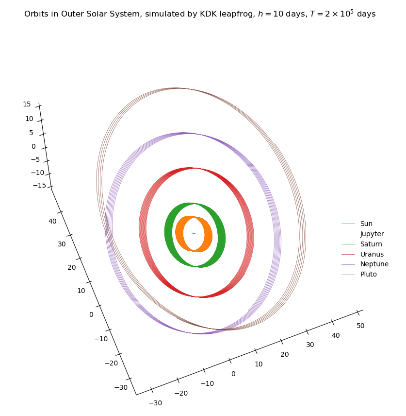

Norbit
==========

*Yet another (lite) toy N-body simulation*
--------------------

This mini package provides a proof-of-concept of N-body simulations of systems that evolve under only gravitational forces.

## Currently Implemented Features

- Direct summation for force evaluation (which scales as $\mathcal{O}(N^2)$)
- 2nd-order symplectic and 4th-order non-symplectic integrators

## Examples

- An example of initial conditions for the Outer Solar System is provided at `./examples/initial_conditions_outer_solar.py`
- For more details, please see the notebook `./Norbit_demo.ipynb`

