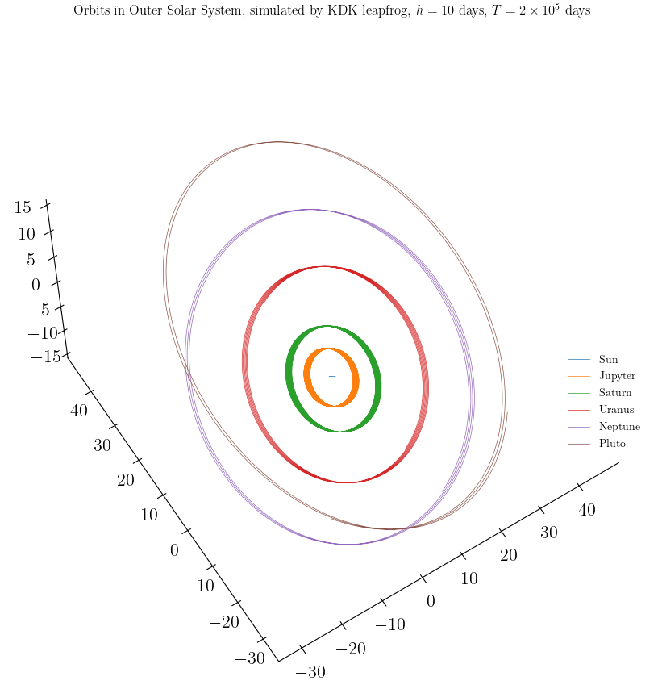
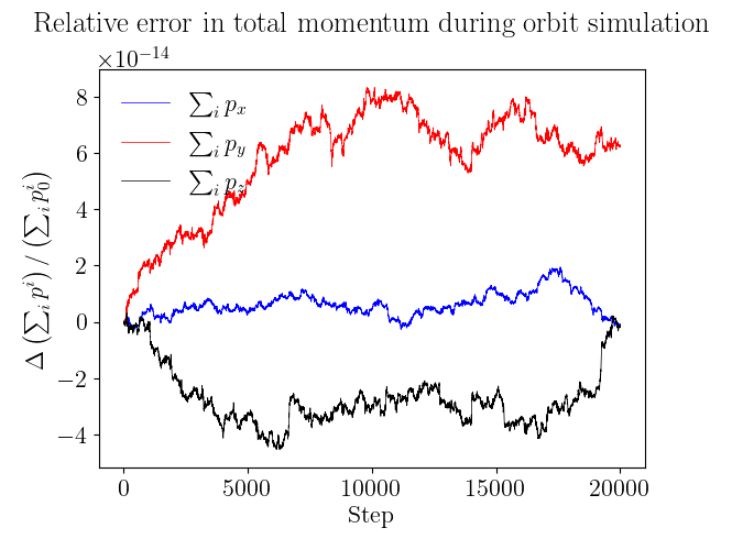

N 
==========

*Norbit - yet another (lite) toy N-body simulation*
--------------------

This mini package provides a proof-of-concept of N-body simulations of systems that evolve under only gravitational forces.

  

## Currently Implemented Features

- Direct summation for force evaluation, which scales as 
- 2nd-order symplectic and 4th-order non-symplectic integrators

## Examples

- An example of initial conditions for the Outer Solar System is provided at `./examples/initial_conditions_outer_solar.py`. The example is taken from section I.2.4 of <a href=”https://link.springer.com/book/10.1007/3-540-30666-8”> Geometric Numerical Integration, Hairer 2006</a>.
- For more details, please see the notebook `./Norbit_demo.ipynb`

